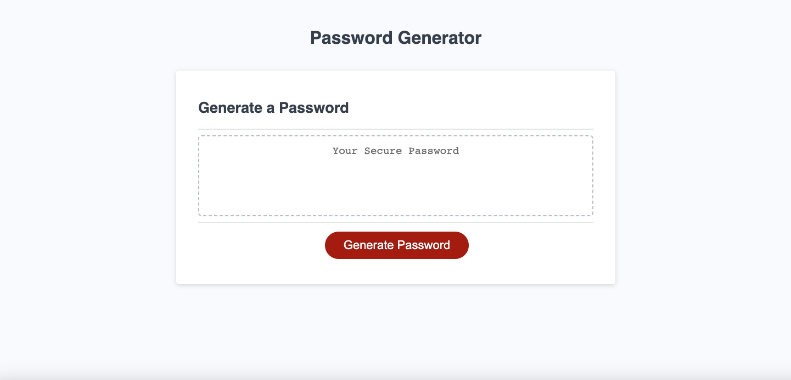
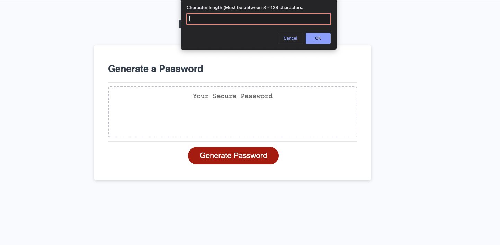
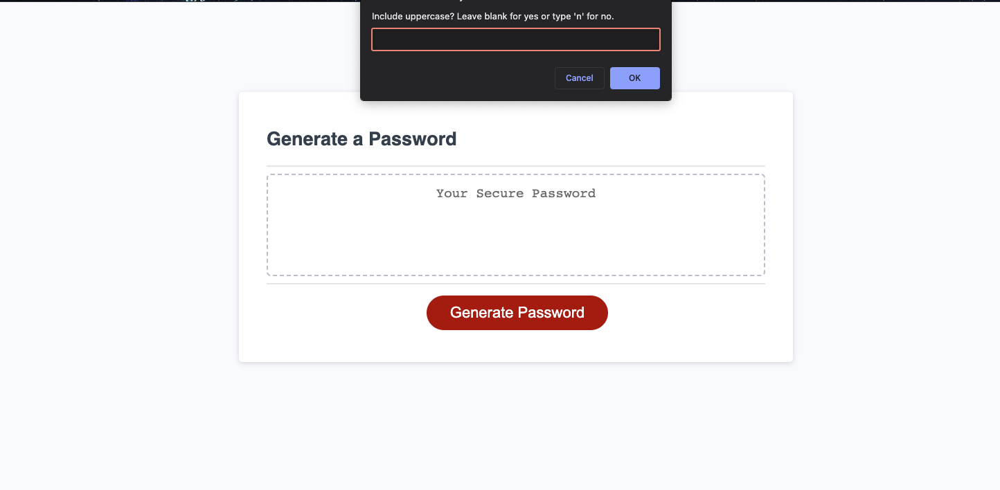
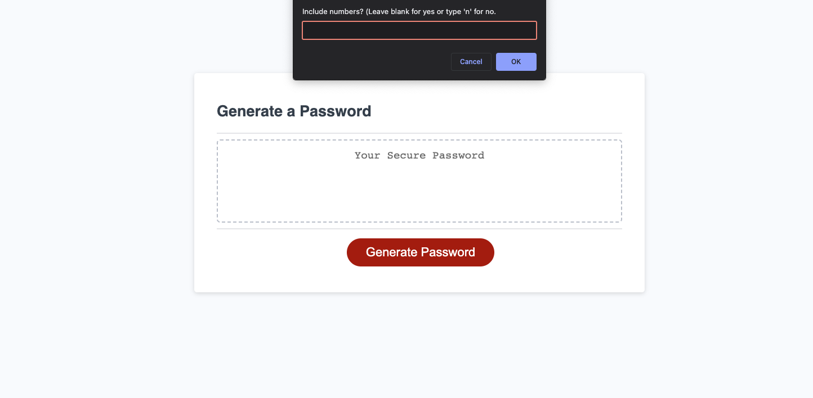
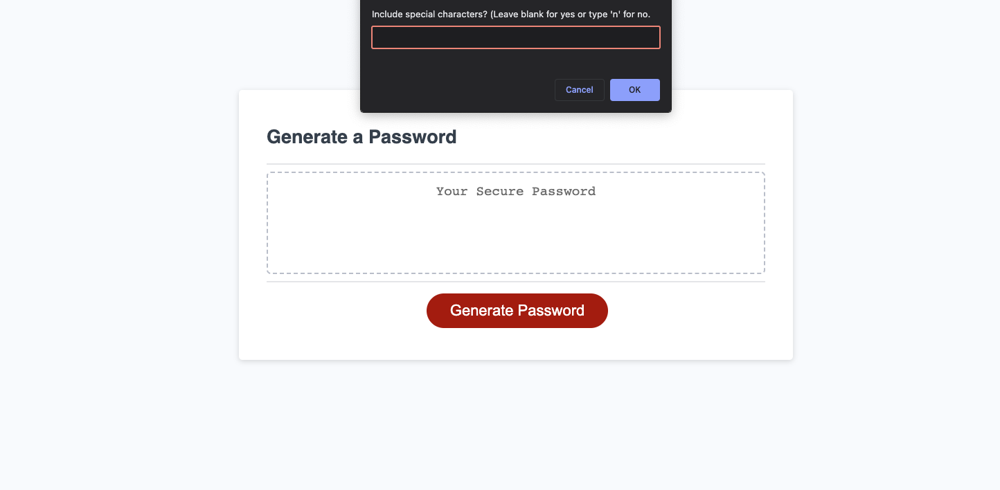
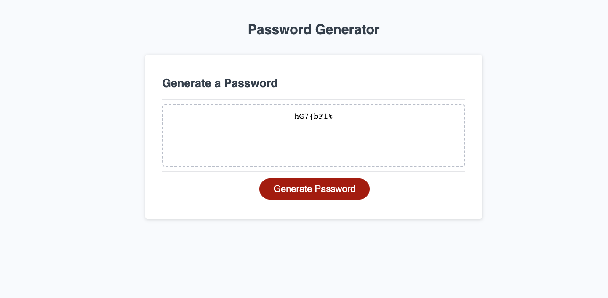

# Password Generator

## Description

This project was made as an assignment from the third week of the U of U Coding Bootcamp. It is a password generator using *HTML*, *CSS* and *Javascript*. In this project I used the skills I learned from that week's module, such as **if statements**, **functions**, **Arrays**, **Objects** and other basic Javascript concepts.

## Usage

The webpage contains a form with a text box and a button to generate our random password.
Here's the  link to the deployed application:
* https://mrpolkadot.github.io/password-generator

When the button is clicked, a set of prompts will appear. It asks for certain criteria for the password(*length, lowercase, uppercase, numbers, special characters*).

Each criteria is taken into account and the password is created based on the options you choose. In the example below, all criteria were chosen, with 8 characters as our length.

## Credits

Useful links: 
* https://www.coderrocketfuel.com/article/generate-a-random-letter-from-the-alphabet-using-javascript
* https://stackoverflow.com/questions/24597634/how-to-generate-an-array-of-the-alphabet

